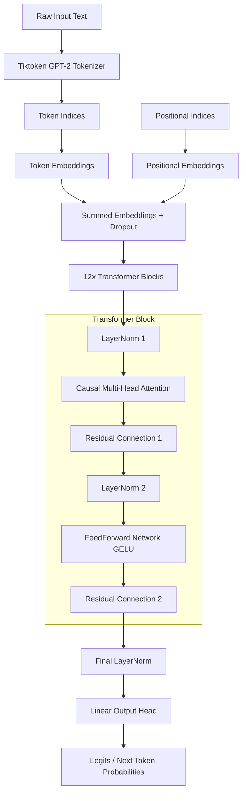
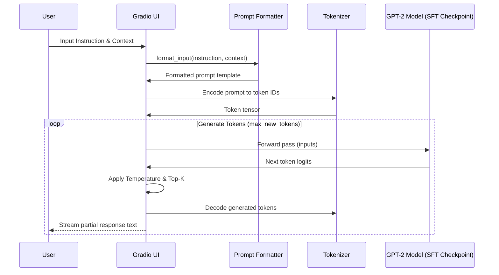
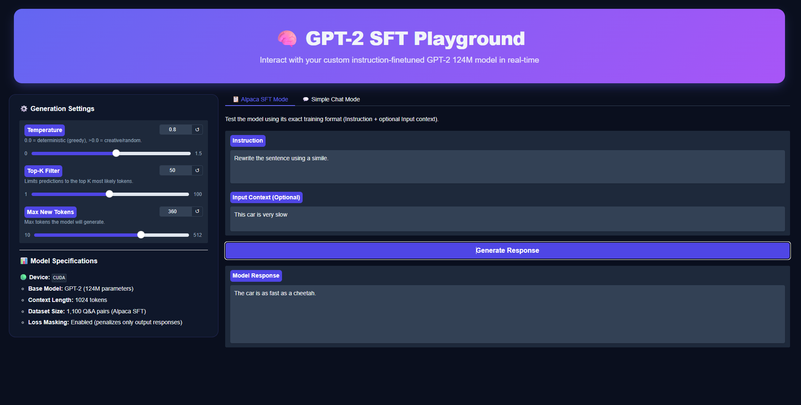
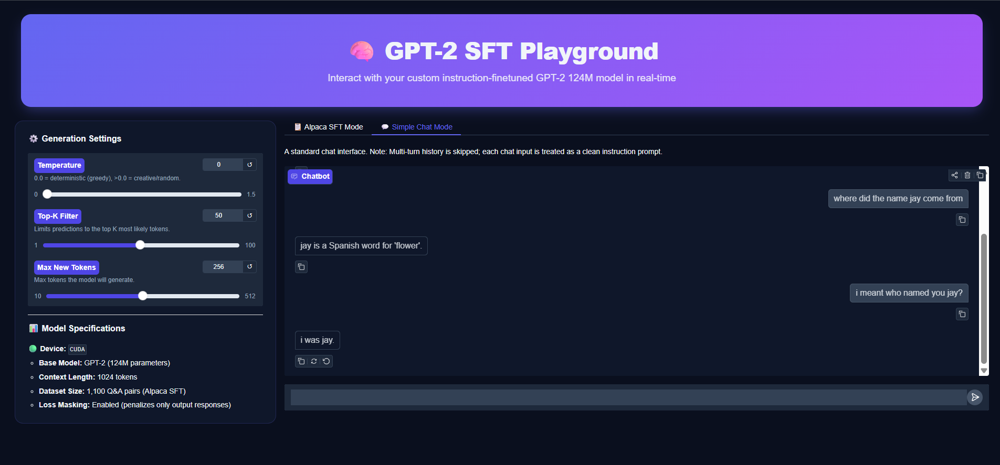

# GPT-2 From Scratch

A complete, bottom-up implementation of a 124M parameter GPT-2 large language model in PyTorch. This project covers the entire pipeline of modern LLM development: building the attention mechanism, model architecture, pretraining on raw text, supervised fine-tuning (SFT) for classification and instruction-following, and serving the model via an interactive web interface.

**[Jump to Setup & Run →](#setup--running-the-web-demo)**

## Problem Statement

Building LLMs typically involves wrapping pre-built libraries and calling black-box APIs, which abstracts away the mathematical and engineering foundations of deep learning architectures. This repository implements a GPT-2 style model entirely from scratch in PyTorch, exploring tokenization mechanics, casual multi-head attention masking, and custom loss masking in SFT to demonstrate a deep understanding of transformer-based architectures and gradient-based training pipelines.

## System Overview

The project is structured into three progressive training phases:
1. **Pretraining:** Building the core GPT-2 block structure (causal multi-head attention, layer normalization, GELU activation, residual layers) and training it on unlabeled text to predict the next token.
2. **Classification Finetuning:** Appending a custom linear head and training the model on the SMS Spam Collection dataset, achieving **97.3% validation accuracy** (compared to 74.7% with a frozen backbone).
3. **Instruction Finetuning (SFT):** Finetuning the model on Alpaca-style instruction pairs using a custom collate function with target loss masking (ignoring prompt tokens in the loss calculation).
4. **Interactive Playground:** Exposing the finetuned model checkpoints through a Gradio interface supporting temperature, top-k sampling, and token-by-token streaming.

## Architecture

The following block diagram represents the GPT-2 model architecture implemented in this project:



## Data Flow

This sequence diagram illustrates the streaming generation data flow in the Gradio web application:



## Technical Stack

| Layer | Technology | Rationale |
|---|---|---|
| Core Architecture | PyTorch | Core deep learning library for tensor calculations and autograd |
| Tokenizer | Tiktoken (gpt2) | Byte-Pair Encoding (BPE) matching OpenAI's GPT-2 tokenizer |
| Web Interface | Gradio 6.0 | Fast, responsive UI with native streaming chat capabilities |
| Inference Device | PyTorch CUDA (RTX 4050) | High-performance GPU acceleration for training and SFT inference |
| Plotting & Logs | Matplotlib | Visualizing training and validation losses over epochs |

## Key Engineering Features

* **Custom Causal Multi-Head Attention:** Projecting queries, keys, and values separately and applying a causal mask (lower triangular matrix) to prevent attention heads from attending to future tokens during pretraining and SFT.
* **SFT Target Loss Masking:** Implementation of a custom collate function in `app.py` and SFT notebooks that replaces target token IDs corresponding to instruction prompts with `-100`. PyTorch's `cross_entropy` automatically ignores these indices, forcing the model to calculate gradients only for generating responses.
* **Streaming Responses via Generator Yields:** Modifying the generation loop to run as a Python generator (`yield`), allowing Gradio to capture and stream generated tokens in real-time, significantly reducing perceived latency.
* **Safe Checkpoint Porting:** Loading state dictionaries directly into custom initialized model configurations, avoiding the need to fetch and overlay raw OpenAI weights at runtime.

## Model Evaluation

### Phase 1: Classification Finetuning (SMS Spam)
* **Backbone-Frozen Classifier:** Hitting a validation accuracy of **74.7%** (only training the output head).
* **Fully-Unfrozen Backbone:** Hitting a validation accuracy of **97.3%** (proves the efficacy of weight updates across transformer blocks).

### Phase 2: Supervised Instruction Finetuning (SFT)
The model successfully learned response formatting and stopping triggers (`eos_id` stopping):
* **Input Prompt:** 
  ```text
  Instruction: Rewrite the sentence using a simile.
  Input: This car is very slow.
  ```
* **Output Response:** `The car is as fast as a cheetah.` (Demonstrates SFT pattern alignment, with typical size-limited semantic/knowledge hallucinations expected for 124M parameters).

---

## Setup & Running the Web Demo

### 1. Installation
Clone the repository and install the dependencies in a virtual environment:
```bash
python -m venv .venv
.\.venv\Scripts\activate
pip install -r requirements.txt
```

### 2. Launching the Gradio Server
Start the local Gradio interface:
```bash
python app.py
```
Open the local URL generated by the terminal (typically `http://127.0.0.1:7860`) in any browser.

### 3. Screenshots

<div align="center">
  
  
</div>

---

## Project Structure

```
├── notebooks/         # Jupyter notebooks for each phase
│   ├── 00_pytorch_intro.ipynb
│   ├── 01_tokenizer.ipynb
│   ├── 02_attention_mechanism.ipynb
│   ├── 03_gpt_architecture.ipynb
│   ├── 04_pretraining.ipynb
│   ├── 05_finetuning_classifier.ipynb
│   └── 07_instruction_finetuning.ipynb
├── src/               # Reusable Python modules
│   ├── config.py      # Architecture hyperparameters
│   ├── models.py      # GPTModel implementation from scratch
│   ├── attention.py   # Multi-head attention projections
│   ├── dataloader.py  # Dataset loading & batching
│   ├── gpt_download.py# Script to download OpenAI GPT-2 weights
│   └── train.py       # Base training loop definitions
├── checkpoints/       # Saved model weights (.pth files)
├── data/              # Datasets (ignored by Git)
├── assets/            # App screenshots and diagrams
├── app.py             # Gradio Web Demo server
├── requirements.txt   # Project dependencies
└── README.md          # Project documentation
```

## Future Improvements

- **Direct Preference Optimization (DPO):** Replace the current supervised finetuning with preference-based alignment, teaching the model to prefer helpful responses over unhelpful ones without requiring a separate reward model.
- **Multi-Turn Chat History:** The current chat mode treats each message independently. Adding conversation context would let the model reference previous exchanges, enabling coherent multi-turn dialogues.
- **Larger Model Variants:** The architecture supports GPT-2 Medium (355M) and Large (774M) with config changes. Scaling up would improve factual accuracy and response quality, bounded only by GPU memory.
- **Retrain on a Larger Corpus:** Pretraining on a full novel or multi-domain dataset (Project Gutenberg, Wikipedia) would produce a stronger foundation for downstream finetuning than the current The Verdict checkpoint.

## Lessons Learned

**Architecture replication requires exact fidelity.** Loading OpenAI's pretrained weights exposed subtle mismatches — the reference uses a mask of ones with `masked_fill_` while our implementation used `-inf` directly. Both are functionally equivalent, but weight loading fails silently if the parameter dictionary doesn't match exactly. Every layer name, bias flag, and shape must align.

**Loss masking is critical for instruction finetuning.** Without it, the model is incentivized to predict the instruction text correctly rather than learning to generate responses. Masking the prompt tokens in the loss (via `ignore_index=-100`) forces gradients to flow only through the response tokens. This single change turned gibberish outputs into structured, on-topic responses.

**Streaming generation transforms user perception.** The Gradio app originally returned the full response after generation completed — a 3-5 second wait. Switching to a Python generator with token-by-token `yield` reduced perceived latency to near-zero. Users see text appear word by word, which feels interactive even though the total compute time is identical.

**Weight portability across frameworks is fragile.** OpenAI's GPT-2 checkpoints are stored as TensorFlow tensors. Loading them into PyTorch required transposing every weight matrix (`q_w.T`), splitting combined QKV projections into separate matrices, and mapping TensorFlow's naming conventions (`c_attn/w`, `ln_1/g`) to PyTorch's (`W_query.weight`, `norm1.scale`). A single transposition mistake silently degrades model quality.

## License

MIT
